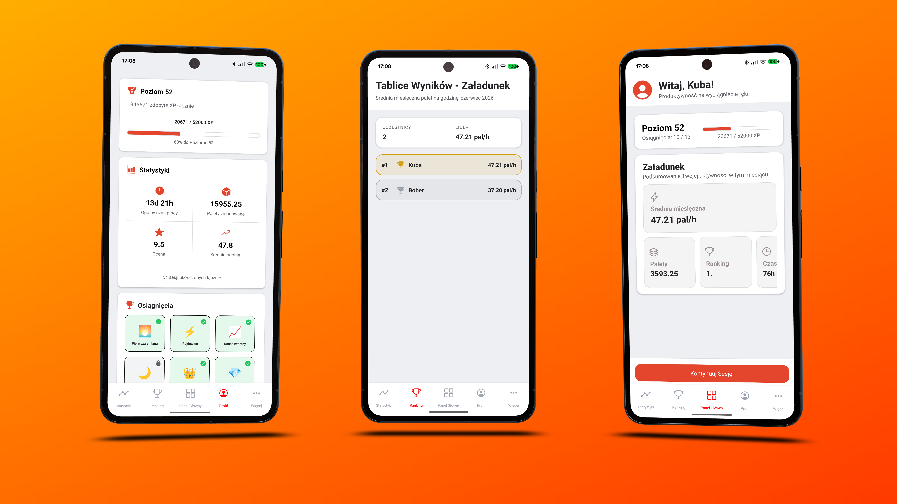
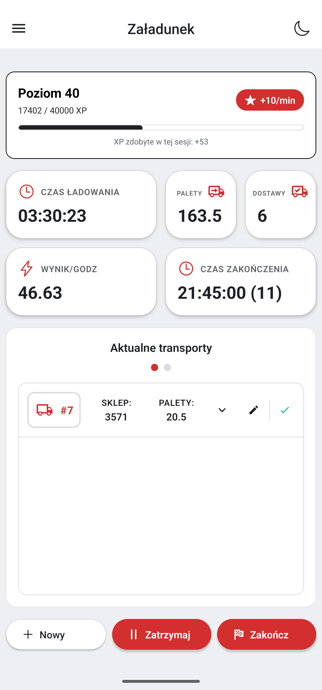
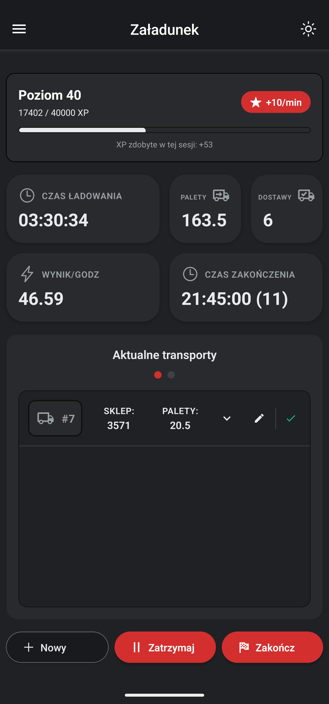
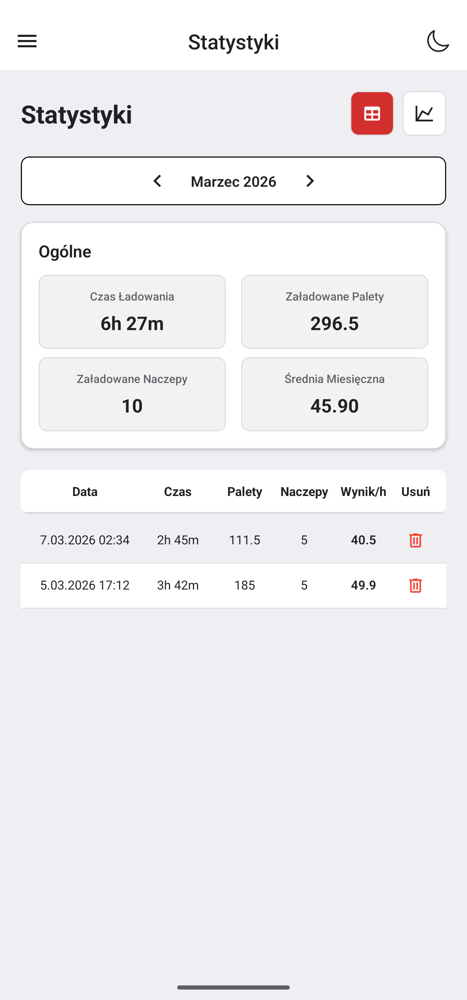
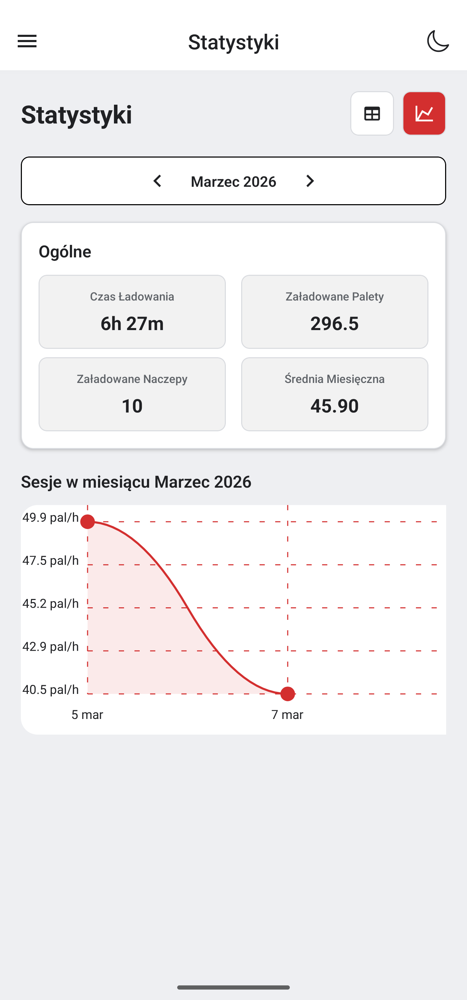
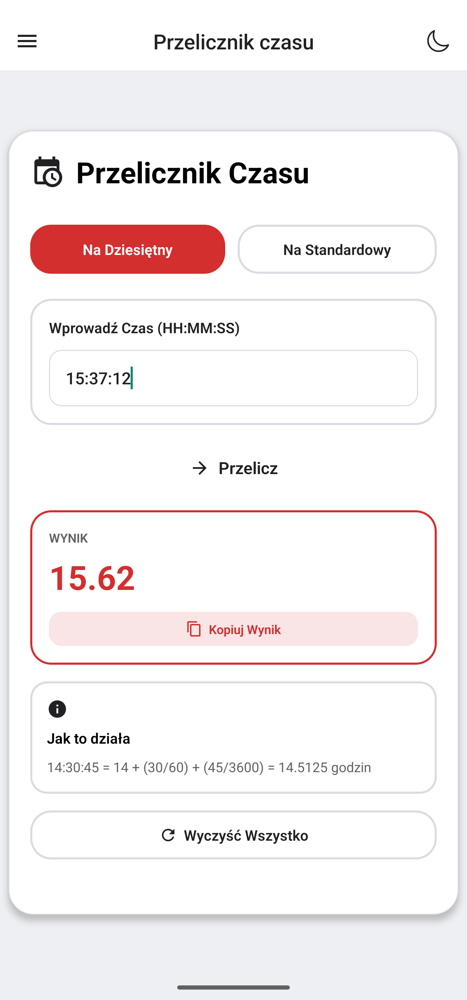
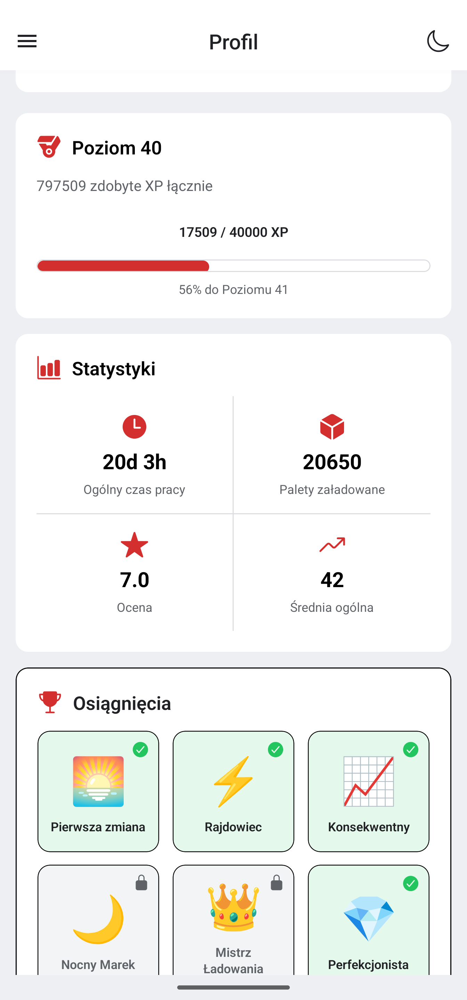

# JMP-Tools-Native - Warehouse Performance Tracker

A mobile app designed to help warehouse workers track, analyze, and improve their daily performance.

The app allows users to calculate and save work sessions, monitor efficiency, and review statistics across multiple time ranges including daily, monthly, and overall results.

It also includes helpful tools for common warehouse tasks and a gamified motivation system with levels and achievements. Leaderboards are planned in upcoming versions.

The app uses Firebase for authentication and Firestore for storing user sessions and statistics.

## Features

- 📊 Track and save daily work sessions
- 📈 Analyze performance (daily / monthly / overall)
- 🧮 Built-in calculation tools for warehouse tasks
- 🏆 Level and achievement system for motivation
- 💾 Session history tracking
- 📱 Mobile-first interface

Planned features:

- 🥇 Leaderboards
- 👥 Worker comparison statistics
- 📉 Advanced performance analytics

## Tech Stack

Frontend
- React Native
- Expo
- JavaScript

Backend / Services
- Firebase
- Firestore
- Firebase Authentication

Other Tools
- AsyncStorage
- Expo Router

## Screenshots

  

### Session tracker (truck loading section)

  
  

### Statistics

  
  

### Tools

  

### Profile

  

## Project Status

🚧 The project is currently under active development.

Current version: **0.5.0**

Many new features and improvements are planned for upcoming releases.

## Roadmap

Planned improvements:

- Leaderboard system
- Improved statistics dashboard
- Additional warehouse calculation tools
- UI improvements
- Exportable performance reports

