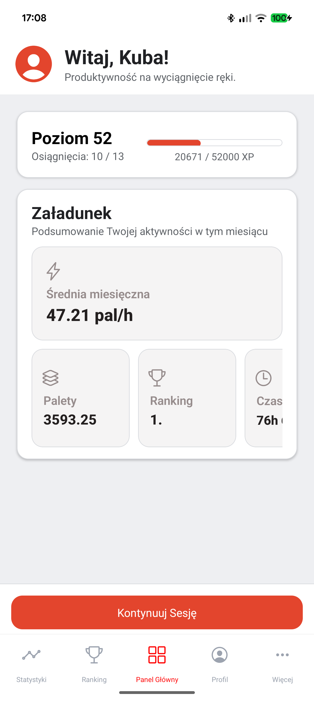
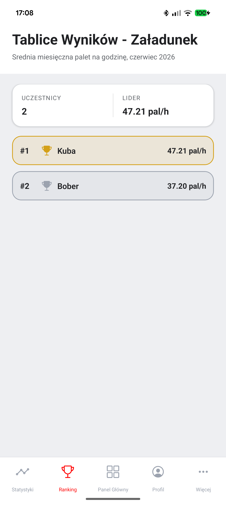
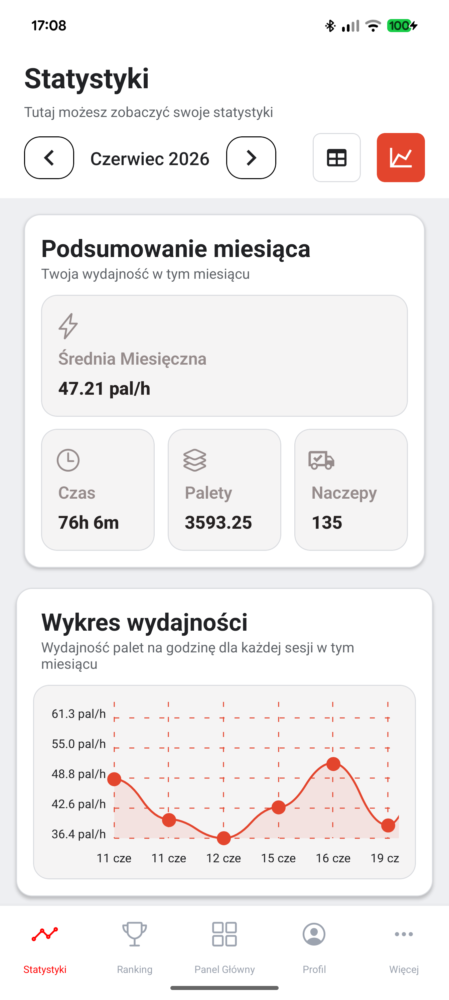
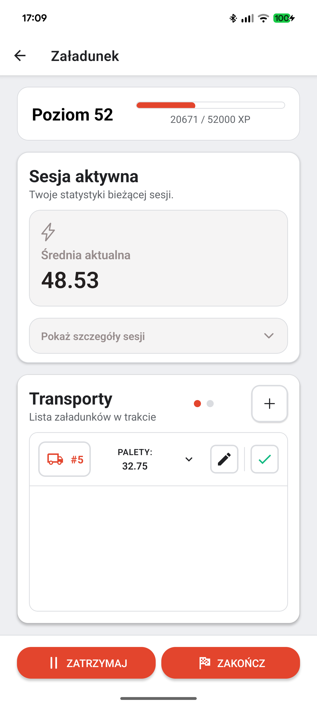
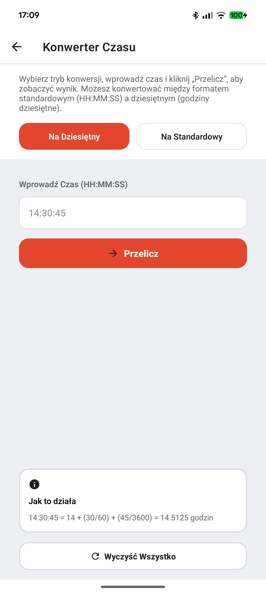
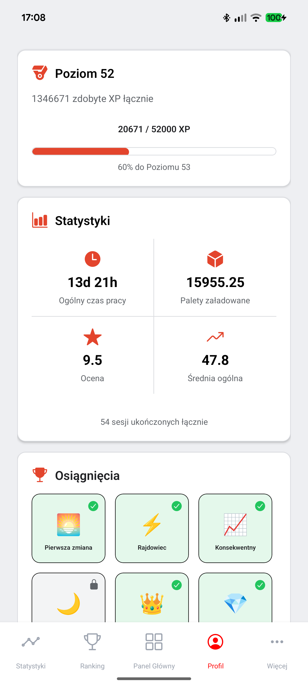

# JMP-Tools-Native - Warehouse Performance Tracker

A mobile app designed to help warehouse workers track, analyze, and improve their daily performance.

The app allows users to calculate and save work sessions, monitor efficiency, and review statistics across multiple time ranges including daily, monthly, and overall results.

It also includes helpful tools for common warehouse tasks, a gamified motivation system with levels and achievements, and a new reporting workflow for managing session-related reports.

The app uses Firebase for authentication and Firestore for storing user sessions and statistics.

## Features

- 📊 Track and save daily work sessions
- 📈 Analyze performance (daily / monthly / overall)
- 📈 Fully functional statistics dashboard with detailed performance insights
- 🏆 Leaderboards for comparing results
- 📝 Reporting flow and report management
- 🔎 Detailed active session modal with richer information
- 🎨 Improved user interface
- 🧮 Built-in calculation tools for warehouse tasks
- 🏅 Level and achievement system for motivation
- 💾 Session history tracking
- 📱 Mobile-first interface

## Tech Stack

Frontend
- React Native
- Expo
- JavaScript

Backend / Services
- Firebase
- Firestore
- Firebase Authentication

Other Tools
- AsyncStorage
- Expo Router

## Screenshots

  

### Dashboard

  

### Leaderboards

  

### Statistics

  

### Session tracker (truck loading section)

  

### Tools

  

### Profile

  

## Project Status

🚧 The project is currently under active development.

Current version: **0.10.0**

The latest update added a richer active session experience, a reporting flow, and report management tools to make day-to-day warehouse tracking more complete.

## Roadmap

### Next planned feature
- Calculator for picking section

### Future plans
- English version of the app
- Web version of the app for office workers
- Add pallet locations and find them more easily in the app- Report truck damages for truck loaders
- Exportable performance reports

## Acknowledgements
* Visual assets generated via [Device Frames](https://deviceframes.com/)
