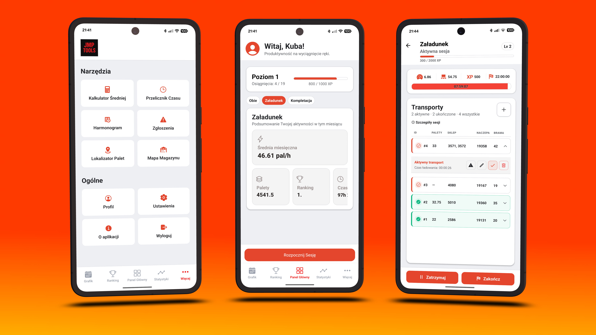
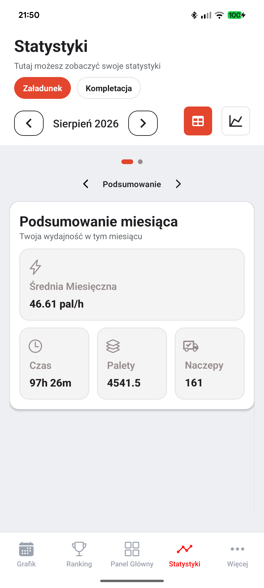
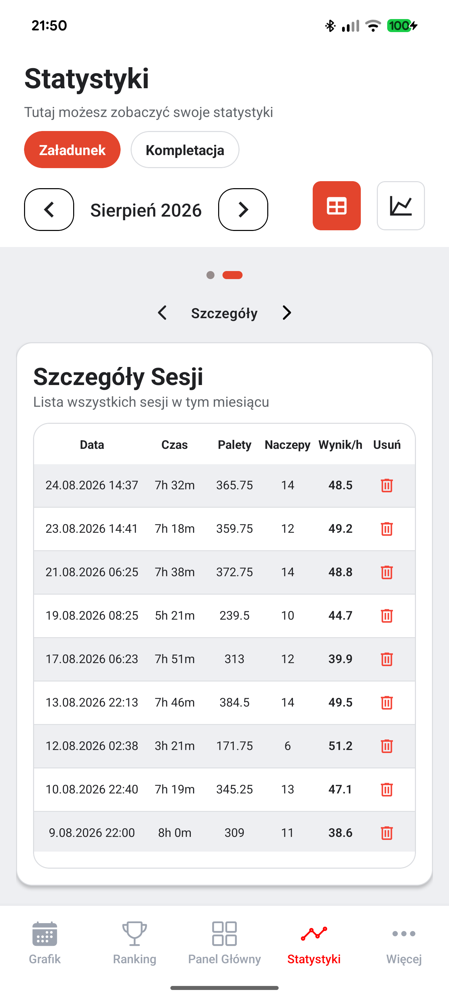
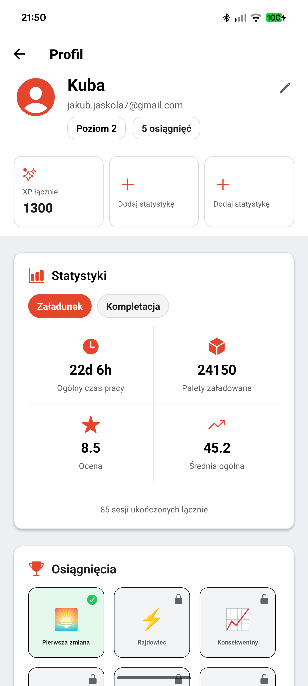

# JMP-Tools-Native - Warehouse Performance Tracker

A mobile app designed to help warehouse workers track, analyze, and improve their daily performance.

The app allows users to calculate and save work sessions, monitor efficiency, and review statistics across multiple time ranges including daily, monthly, and overall results.

It also includes helpful tools for common warehouse tasks, a gamified motivation system with levels and achievements, and a new reporting workflow for managing session-related reports.

The app uses Firebase for authentication and Firestore for storing user sessions and statistics.

Version 0.11.0 introduces a new picking architecture, a notification system, an interactive warehouse map with pallet mapping, and a smarter schedule workflow powered by OCR.

## Features

- 📊 Track and save daily work sessions
- 📈 Analyze performance (daily / monthly / overall)
- 📈 Statistics dashboard with detailed performance insights
- 🏆 Global and monthly leaderboards for comparing results (optimized Firestore usage)
- 🧮 Built-in calculation tools for warehouse tasks
- 🚚 Unified session engine for truck loading and picking subsections (P01–P28)
- 🧠 State-aware calculator header with live context and XP progress bar integration
- 🏅 Level and achievement system for motivation with optimized XP and stats updates
- 💾 Session history tracking
- 📝 Reporting flow and report management with statuses and attribution for reported items
- 🔔 Notification module with debounced settings and Firestore-based persistence
- 🗺️ Interactive warehouse map with pan, pinch-to-zoom, inertial scrolling, and zone focus animation
- 📍 Mapping screen to create, edit, and filter pallet locations, plus “Show on map” navigation
- 📅 Timetable / schedule component with OCR scanner that turns scans into usable table values
- ⚙️ Settings screen synchronized with Firestore as the single source of truth
- 📱 Mobile-first interface

## Tech Stack

**Frontend**

- React Native
- Expo
- JavaScript

**Backend / Services**

- Firebase
- Firestore
- Firebase Authentication

**Other Tools**

- Expo Router
- AsyncStorage
- Expo Notifications (for scheduled and shift-related notifications)

## Screenshots

  

<!-- ### Leaderboards

  

 -->

### Statistics

  
  

<!-- ### Tools

  

 -->

### Profile

  

## Performance and Stability

0.11.0 includes a major optimization and stability pass focused on Firestore usage, navigation safety, and profile integrity.[file:1]

- 🔁 Leaderboards migrated from heavy `collectionGroup` aggregation to a single-document-per-month model (`leaderboards/YYYY-MM`), reducing Firestore reads by orders of magnitude.
- 🧮 Leaderboard updates and ranking logic moved to Firestore transactions for both loading and picking results.
- ⚡ XP, total XP, and achievements now update incrementally in the user profile document without parsing historical sessions on startup.
- 🛡️ Profile data, nested fields, and push token synchronization hardened against overwrites and malformed paths.
- 🚀 Global loading guard and improved cleanup logic prevent race-condition crashes when navigating between profile, dashboard, and leaderboards.

## Project Status

🚧 The project is currently under active development.

Current version: **0.11.0**

The latest update delivers the new picking subsection engine, a notification and timetable workflow, interactive warehouse mapping with pallet locations, and a broad set of performance and stability optimizations to make daily warehouse tracking smoother and more reliable.

## Roadmap

### Future plans
- English version of the app
- Web version of the app for office workers
- Exportable docs for office workers

## Acknowledgements
* Visual assets generated via [Device Frames](https://deviceframes.com/)
